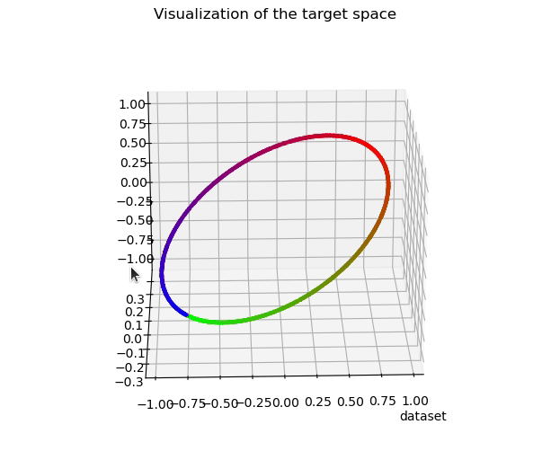
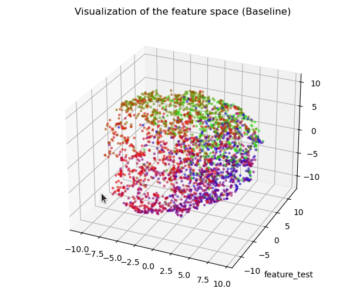

 

The official code of "Deep Regression Representation Learning with Topology" in ICML 2024. [[PDF]](https://arxiv.org/pdf/2404.13904.pdf).

### Experiments on the synthetic dataset

- main.py :  Obtain experimental results on the synthetic dataset
- visualization.py: Visualizing the feature space, the input space and the target space.
- PH_Reg.py: Code of our proposed PH-Reg.
- ordinal_entropy.py: Code of the regression baseline

You can generate your own synthetic dataset by:

- run data/synthetze_datasets.py

### Experiments on Real-world Datasets

We currently provide a detailed code for age estimation. PH-reg can be added in a similar way for other tasks.

For age estimation, we follow the [Imbalanced Regression](https://github.com/YyzHarry/imbalanced-regression/tree/main/agedb-dir), please download Age-DB dataset following their instructions. 

### Acknowledgement

Ph-Reg is built based on the [topological autoencoder](https://github.com/BorgwardtLab/topological-autoencoders) and [Birdal's regularizer](https://github.com/tolgabirdal/PHDimGeneralization).

An old version of the paper can be found [here](https://openreview.net/forum?id=OeNcnlQPRz). Shihao wanted to express his gratitude for the high-quality comments made by the reviewers, which definitely improved the paper. 
